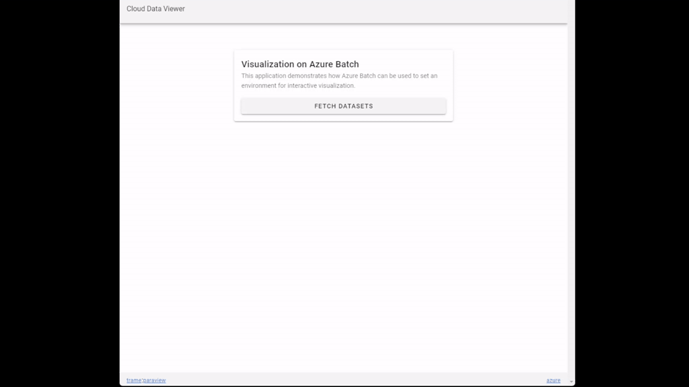

# Simplified Azure Batch Deployment for HPC use-cases

This project demonstrates how to setup an Azure environment that uses Azure Batch
managed service for typical HPC use-cases. This can serve as the starting point for
production deployments for similar applications and use-cases applicable to wide
variety of domains.

## Applications / Demos

This project currently includes the following demos.

### AzFinSim: Fintech Risk Simulation

[AzFinSim](https://github.com/utkarshayachit/azfinsim/tree/refactor)
is a simple application that models a typical trade
risk analysis in FinTech. While the application provided is a synthetic risk
simulation designed to demonstrate high throughput in a financial risk/grid
scenario, the actual framework is generic enough to be applied to any
embarrassingly parallel / high-throughput computing style scenario. If you have
a large scale computing challenge to solve, deploying this example is a
good place to start, and once running it's easy enough to insert your own code
and libraries in place of AzFinSim.

Key features:

* application containerized using `Docker`
* executed by performing a parameter sweep in an embarrassingly parallel mode
* `todo-->`: add more stuff that mentions important aspects of this demo

### Catalyst-enabled LULESH: Scientific Simulation with 3D Visualization

[LULESH](https://asc.llnl.gov/codes/proxy-apps/lulesh)  a simple application
that represents other mainstream hydrocodes like [ALE3D](https://wci.llnl.gov/simulation/computer-codes/ale3d).
It is hardcoded to solve a simple Sedov blast propagation problem. To make the
results interesting, lets also say we want to generate visualization results to
monitor the progress of the simulation. For that we use
[ParaView](https://www.paraview.org/), an open source scientific data analysis
and visualization tool that is widely used within the HPC community. ParaView supports
in situ data processing API called Catalyst which makes it possible to generate
visualization results inline with the simulation code, without having to save the
simulation results to disk.

This demo can be used as a template for any large scale batch data analysis and visualization
problems typical in scientific computing applications.

This demo uses a [public fork of LULESH](https://github.com/utkarshayachit/LULESH) which
adds Catalyst API instrumentation to the simulation code.

Key features:

* 3D-rendering using ParaView-Catalyst
* [todo] MPI
* [todo] add other stuff (perhaps parameter sweep, custom script upload etc. etc.)

### trame: interactive web-based 3D visualization using trame and ParaView

Visualizing computation results is key to gaining insights from HPC workloads. This application
demonstrates how we can use Azure Batch to support a website that lets users visualize scientific
datasets interactively from the browser itself.



This demo uses the ParaView/trame-based visualization application available [here](https://github.com/utkarshayachit/vizer).


## Deployment

Before you can try any of the demos, you first need to deploy the infrastructure on Azure.
This section takes you through the steps involved in making a deployment.

### Prerequisites

1. **Ensure valid subscription**: Ensure that you a chargeable Azure subscription that you
   can use and you have `Owner` access to the subscription.

2. **Accept legal terms**: The demos use container images that require you to accept
   legal terms. This only needs to be done once for the subscription. To accept these legal terms,
   you need to execute the following Azure CLI command once. You can do this using the
   [Azure Cloud Shell](https://ms.portal.azure.com/#cloudshell/) in the [Azure portal](https://ms.portal.azure.com)
   or your local computer. To run these commands on your local computer, you must have Azure CLI installed.

   ```sh
   # For Azure Cloud Shell, pick Bash (and not powershell)
   # If not using Azure Cloud Shell, use `az login` to login if needed.

   # accept image terms
   az vm image terms accept --urn microsoft-azure-batch:ubuntu-server-container:20-04-lts:latest
   ```

3. **Get Batch Service Id**: Based on your tenant, which may be different, hence it's
   best to confirm. In [Azure Cloud Shell](https://ms.portal.azure.com/#cloudshell/),
   run the following:

   ```sh
    az ad sp list --display-name "Microsoft Azure Batch" --filter "displayName eq 'Microsoft Azure Batch'" | jq -r '.[].id'

    # output some alpha numeric string e.g.
    f520d84c-3fd3-4cc8-88d4-2ed25b00d27a
   ```

   Save the value shown then you will need to enter that value,
   instead of the default, for `batchServiceObjectId` (shown as **Batch Service Object Id**,
   if deploying using the portal) when deploying the infrastructure.

   If the above returns an empty string, you may have to register "Microsoft.Batch" as a registered
   resource provider for your subscription. You can do that using the portal, browse to your `Subscription >
   Resource Providers` and then search for `Microsoft.Batch`. Or use the following command and then try
   the `az ad sp list ...` command again

   ```sh
   az provider register -n Microsoft.Batch --subscription <your subscription name> --wait
   ```

4. **Validate Batch account quotas**: Ensure that the region you will deploy under has
   not reached its batch service quota limit. Your subscription may have limits on
   how many batch accounts can be created in a region. If you hit this limit, you
   may have to delete old batch account, or deploy to a different region, or have the
   limit increased by contacting your administrator.

5. **Validate compute quotas**: Ensure that the region you will deploy under has not
   sufficient quota left for the SKUs picked for batch compute nodes. The AzFinSim
   and LULESH-Catalyst demos use `Standard_D2S_V3` while the trame demo uses
   `Standard_DS5_V2` by default. You can change these by modifying the `pools.bicep`
   files for each of the demos under `apps/` directory.

### Using Azure CLI

There are multiple ways of deploying any infrastructure in Azure. Here, we use
[Azure CLI](https://learn.microsoft.com/en-us/cli/azure/)
to deploy the infrastructure described using Bicep files.

Make sure you have the latest [Azure CLI](https://learn.microsoft.com/en-us/cli/azure/) installed
on your workstation. ALternatively, you can use the Azure Cloud Shell from Azure portal
which already has the necessary tools installed.

```sh
# clone this repository
git clone https://github.com/utkarshayachit/simplified-batch.git

# change working directory
cd simplified-batch

# login to your account
az login

# set active subscription
az account set -s <subscription name or ID>

# location where you want to deploy
AZ_LOCATION=eastus2

# name for this deployment
AZ_DEPLOYMENT_NAME=dpl-<your initials>-$AZ_LOCATION

# a string to identify you (or any text you like)
AZ_DEPLOYER=me@email.org

# batch service object id obtained earlier
AZ_BATCH_SERVICE_OBJECT_ID=<....>

# some prefix used for resources etc.
# this can be any alphanumeric string;
# one suggestion is given below
AZ_PREFIX=<your initials><MMDDYY><suffix>

# create deployment
az deployment sub create --location $AZ_LOCATION             \
         --name $AZ_DEPLOYMENT_NAME                          \
         --template-file infrastructure.bicep                \
         --query properties.provisioningState                \
         --output tsv                                        \
         --parameters                                        \
            prefix=$AZ_PREFIX                                \
            deployer=$AZ_DEPLOYER                            \
            batchServiceObjectId=$AZ_BATCH_SERVICE_OBJECT_ID \
            enableAzFinSim=true                              \
            enableLuleshCatalyst=true                        \
            enableTrame=true

# on success, this print
Succeeded

# if deployment succeeded, use this to get some deployment outputs.
az deployment sub show --name $AZ_DEPLOYMENT_NAME        \
   --query '{AZ_BATCH_ENDPOINT: properties.outputs.batchAccountEndpoint.value, AZ_ACR_NAME: properties.outputs.containerRegistryName.value, TRAME_WEBSITE_URL: properties.outputs.trameURL.value, DATASETS_STORAGE_NAME: properties.outputs.datasetsSAName.value}'
# this will generate output of the form:
{
  "AZ_BATCH_ENDPOINT": "<url>",
  "AZ_ACR_NAME": "<name>",
  "TRAME_WEBSITE_URL": "<url>",
  "DATASETS_STORAGE_NAME": "<name>"
}
```

This will trigger the deployment in a default configuration. Supported parameters
and their details are given in the following section. The output text shows three values:
URL for the batch service, the name of the container registry, and, if `trame` application
was enabled, then the URL for the trame website. Store these values so you can use them when executing the demo apps.

**NOTE:** Feel free to change the enableAzFinSim, enableLuleshCatalyst, or
enableTrame parameters to `false` (or simply remove them) if you want to test out
only one specific application. All applications are independent of one another and
can be deployed by themselves.

### Parameters

The following are required parameters:

* **batchServiceObjectId** *(string)*: the object id for the Azure Batch Service
  obtained using steps described in the prerequisites section.

Here are the optional parameters:

* **location** *(string, **default-value**: deployment location)*:
  the location for all the resources. Currently,
  pools without public IP addresses (which is what this setup uses) is only available
  at the locations listed [here](https://learn.microsoft.com/en-us/azure/batch/simplified-compute-node-communication#supported-regions).

* **environment** *([`dev`, `prod`], **default-value**: `dev`)*:
  a string used to identify the deployment. Currently, this is just used to when creating
  resource group names etc. Primarily intended to demonstrate how one can setup infrastructure
  for different environment like testing, development production etc. with ease.

* **prefix** *(string, **default-value**: `uniqueString(environment, subscription().id, location)`)*:
  a prefix string used when naming groups, resources, and deployments. Makes it easier
  to deploy multiple instances of this infrastructure under the same subscription.

* **deployer** *(string, **default-value**: `someone@somedomain.com`)*:
  a string that is added as a tag named `deployed-by` to the resource groups created.
  while it may be used to determine who created these resources, it's does not serve
  any specific purpose in this setup and only provided for illustrative purposes.

* **useSingleResourceGroup** *(bool, **default-value**: `false`)*:
  when set to true, all resources are created under a single group. Default is to create
  different resource groups for resources as appropriate.

* **enableDiagnostics** *(bool, **default-value**: `true`)*:
  when enabled, log analytics workspace and application sights resources are created and used
  to collect diagnostic information from resources.

* **enableHubAndSpoke** *(bool, **default-value**: `false`)*:
  when enabled, deploys the network in a hub-spoke topology. Default it simply use
  a locked-down subset with full egress access and limited ingress.

* **enableVPNGateway** *(bool, **default-value**: `false`)*:
  this is only used when **enableHubAndSpoke** is `true`; when set to true a VPN gateway
  is deployed in the hub to allow clients VPN into the network.

* **enableAzFinSim** *(bool, **default-value**: `false`)*:
  when set to true, enables the AzFinSim application demo and deploys extra resources needed
  for the demo.

* **enableLuleshCatalyst** *(bool, **default-value**: `false`)*:
  when set to true, enables the LULESH-Catalyst application demo and deploys extra resources needed
  for the demo.

* **enableTrame** *(bool, **default-value**: `false`)*:
  when set to true, enables the trame application demo and deploys extra resources needed
  for the demo.

* **branchName** *(string, **default-value**: `main`)*:
  primarily intended for development purposes, identifies the branch from this repository
  to use in the deployment.

## Demonstrations

Once the deployment is successful, we can see each of the demos in action.

### Preparing the environment for the demo applications

The deployment step deploys the infrastructure i.e. the services, the network,
the databases, etc. In a real-world production environment, one would then develop
applications that use this infrastructure to perform the computation and generate
results. In this project, we use simple Python-based applications that
demonstrate this.

To run these applications, you need Python (3.8 or newer) installed on your workstation.
Alternatively, if you have Docker capable workstation, you can build and use the containerized
version of these applications.

#### Option 1: Using Docker

```sh
# ensure we're in the simplified-batch checkout, if not `cd` to it.
cd .../simplified-batch

# build the container image named 'batch-apps'
docker build -t batch-apps:latest -f Dockerfile.apps .

# test the container
docker run -it batch-apps:latest -m batch_controller.azfinsim --help
# this should generate the following output
usage: azfinsim.py [-h] -e BATCH_ENDPOINT {pool,job,cache} ...
...
```

#### Option 2: Using Python

```sh
# you may want to use a virtual environment

# upgrade pip (if needed)
python3 -m pip install --upgrade pip

# install the controller application
python3 -m pip install -e apps/controller

# test the installation
python3 -m batch_controller.azfinsim --help
# this should generate the following output
usage: azfinsim.py [-h] -e BATCH_ENDPOINT {pool,job,cache} ...
...
```

## Demo: AzFinSim

The AzFinSim demo application allows us to inspect the batch pool, resize it,
and submit jobs to populate the cache with trades and process the trades from cache.
The following snippets show how this can be done. Here, replace `python3` with
`docker run -it batch-app:latest` if using the Docker option.

```sh
# these variables must be set to the values obtained on a
# successful deployment (see `az deployment sub show ....`)
AZ_BATCH_ENDPOINT=<...>
AZ_ACR_NAME=<...>

# get pool information
python3 -m batch_controller.azfinsim pool -e $AZ_BATCH_ENDPOINT --info
# output:
=============================================
azfinsim-pool (display name: '<n/a>')
=============================================
State: active (allocation state: steady)
Current Dedicated Size: 0
Current Spot Size: 0

# By default, the pool is setup to have size 0, you can resize it using
# `--resize` as follows
python3 -m batch_controller.azfinsim pool -e $AZ_BATCH_ENDPOINT --resize 1

# Resize continues in the background and can take a while.
# You can check resize status using the same `--info` command as earlier.
# Once the 'Current Dedicated Size' is 1 and allocation state changes to 'steady'
# the resize complete.
```

The AzFinSim application analyzes trades from the redis cache deployed as
part of the deployment. Thus, one of the first tasks is to populate the redis cache.
Let's fill up the cache with 100,000 synthetic trades using the following command.

```sh
# populate 100,000 trades using 10 parallel tasks
python3 -m batch_controller.azfinsim cache -e $AZ_BATCH_ENDPOINT -c $AZ_ACR_NAME \
         --trade-window 100000 \
         --tasks 10
```

Once the cache has been populated, we can analyze it by submitting another job as
follows.

```sh
# process 100,000 trades using 10 parallel tasks
python3 -m batch_controller.azfinsim job -e $AZ_BATCH_ENDPOINT -c $AZ_ACR_NAME \
         --trade-window 100000 \
         --tasks 10
```

### Monitoring

Currently, you can use the Azure portal to monitor. Navigate to the batch account
deployed and you can then navigate to the `pool`, `jobs` etc. to see the pool
and job status. You can also use [Batch Explorer](https://github.com/Azure/BatchExplorer).
We also plan to extend the `batch_controller.azfinsim` to support commands to
monitor jobs and tasks in near future.

## Demo: LULESH-Catalyst

[todo] notes about this demo

## Demo: trame

The `trame` demo is a web-application for interactive visualization. Before we go
the web app, we have to do two things: upload datasets to visualize and resize the
pool.

### Prep: upload datasets

First, locate the name of the storage account that was deployed on which the web-app is designed to browse
datasets. The name is output as the value for '`DATASETS_STORAGE` during deployment. You can also find it
by simply browsing to the resource group named `rg-${environment}-${prefix}-trame`. It's the storage account named
`sa....` under this group.

By default, the deployment is setup in a rather locked-down configuration following good security practices. So you won't
be able to copy dataset files from your local machine directly. You'll need to update firewall exceptions to allow it. Navigate
to the **Networking** page on the storage account in the portal. There, under **Firewall**, you should see a checkbox for
*Add your client IP address ('......')*. Check that and hit **Save**. After a few minutes to update the configurations, you should
be able to browse to **Containers > datasets** and then upload datasets to the storage account. You an also use standard Azure tools
like `azcopy` or `Storage Explorer` to transfer datasets at this stage.

### Prep: resize pool

You can resize the pool as follows:

```sh
# these variables must be set to the values obtained on a
# successful deployment (see `az deployment sub show ....`)
AZ_BATCH_ENDPOINT=<...>

# get pool information
python3 -m batch_controller.trame pool -e $AZ_BATCH_ENDPOINT --info
# output:
=============================================
trame-pool (display name: '<n/a>')
=============================================
State: active (allocation state: steady)
Current Dedicated Size: 0
Current Spot Size: 0

# by default, pool is set to size 0, you can resize it using
# `--resize` as follows:
python3 -m batch_controller.trame pool -e $AZ_BATCH_ENDPOINT --resize 1

# Resize continues in the background and can take a while.
# You can check resize status using the same `--info` command as earlier.
# Once the 'Current Dedicated Size' is 1 and allocation state changes to 'steady'
# the resize complete.
```

Alternatively, you can also use Azure Portal or Azure Batch Explorer to resize the pool named `trame-pool`
on the batch account deployed.

### Using Web Application

Once the pool resize has completed, open your web browser and navigate to the `TRAME_WEBSITE_URL` which was printed out
during deployment. Alternatively, you can browse to the resource group named `rg-${environment}-${prefix}-trame` and then
click on the **App Service** resource, and navigate to the **URL** displayed on the **Overview** page. That will take you
to the demo web-app as shown in the video earlier on this page.


## Architecture Overview

[TODO] Let's take a look at the main resources used in this deployment.

## TODOs

* [ ] spot-vm reclaming and checkpointing

## Acknowledgements

* The deployment architecture is based on [AzureBatch-Secured](https://github.com/mocelj/AzureBatch-Secured).
* The AzFinSim application is forked from [AzFinSim](https://github.com/mkiernan/azfinsim).
